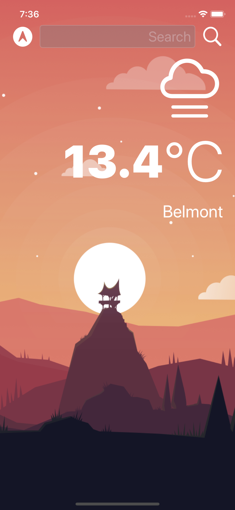

# Clima App 

This project is made following a tutorial on Udemy from Angela Yu.

Topics:
* How to create a dark-mode enabled app
* Learn to use URLSession to network and make HTTP requests
* Parse JSON with the native Encodable and Decodable protocols
* Learn to use Grand Central Dispatch to fetch the main thread
* Learn to use Core Location to get the current location from the phone GPS

